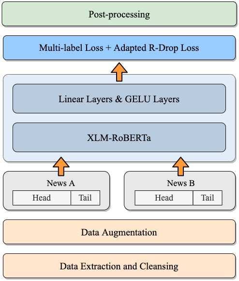

# HFL at SemEval-2022 Task 8: A Linguistics-inspired Regression Model with Data Augmentation for Multilingual News Similarity


# Introduction

Here, we provide the implementation of our winning system in Semeval-2022 Task8 —— Multilingual News Article Similarity. This is a competition about assessing the similarity of multilingual and crosslingual news articles which covers 18 language pairs.

We proposed a linguistics-inspired model trained with a few task-specific strategies. The main techniques of our system are: 1) data augmentation, 2) multi-label loss, 3) adapted R-Drop, 4) samples reconstruction with the head-tail combination. We also present a brief analysis of some negative methods like two-tower architecture in our paper. Our system ranked 1st on the leaderboard while achieving a Pearson's Correlation Coefficient of 0.818 on the official evaluation set.

For more imformation about the contest, please refer to the official site [Semeval2022-Task8](https://competitions.codalab.org/competitions/33835).

For more detailed description of our system, please refer to our paper [HFL at SemEval-2022 Task 8: A Linguistics-inspired Regression Model with Data Augmentation for Multilingual News Similarity](https://aclanthology.org/2022.semeval-1.157/).

Citation:
```
@inproceedings{xu-etal-2022-hfl,
    title = "{HFL} at {S}em{E}val-2022 Task 8: A Linguistics-inspired Regression Model with Data Augmentation for Multilingual News Similarity",
    author = "Xu, Zihang  and
      Yang, Ziqing  and
      Cui, Yiming  and
      Chen, Zhigang",
    booktitle = "Proceedings of the 16th International Workshop on Semantic Evaluation (SemEval-2022)",
    month = jul,
    year = "2022",
    address = "Seattle, United States",
    publisher = "Association for Computational Linguistics",
    url = "https://aclanthology.org/2022.semeval-1.157",
    pages = "1114--1120",
    abstract = "This paper describes our system designed for SemEval-2022 Task 8: Multilingual News Article Similarity. We proposed a linguistics-inspired model trained with a few task-specific strategies. The main techniques of our system are: 1) data augmentation, 2) multi-label loss, 3) adapted R-Drop, 4) samples reconstruction with the head-tail combination. We also present a brief analysis of some negative methods like two-tower architecture. Our system ranked 1st on the leaderboard while achieving a Pearson{'}s Correlation Coefficient of 0.818 on the official evaluation set.",
}

```

# System Overview

### System Structure


<p align="center">
    <br>
    
    <br>
</p>


### System Performance

Finally, our system got 0.818 on the evaluation set according to the official scoring system and ranked 1st out of more than 30 teams. The performance of our system on individual language pairs on the official evaluation set is as displayed below:

| **Language** | en | de | es | pl | tr | ar |  ru | zh | fr | it | esen | deen | plen | zhen | esit | defr | depl | frpl |
| :------: | :------: | :------: | :------: | :------: | :------: | :------: | :------: | :------: | :------: | :------: | :------: | :------: | :------: | :------: | :------: | :------: | :------: | :------: |
| **Pearson's CC** | 87.19 | 84.96 | 86.64 | 75.29 | 83.54 | 79.42 | 78.47 | 76.78 | 86.53 | 86.17 | 86.35 | 85.98 | 88.18 | 81.00 | 81.97 | 68.89 | 64.31 | 82.68 |

# Project Structure

- `data/`
  - `training_set.csv`: an example of training set
  - `testing_set.csv`: an example of testing set
- `log/`
  - `mmregression.log`: an example of training log
- `pretrained_model/`: pretrained model files like `pytorch_model.bin` and `config.json`
- `saved_models`: models saved during training
- `config.json`: configuration file for training parameters
- `models.py`: main classes
- `run_reg.py`: project entry
- `utils.py`: helpful functions for data processing


# Preparation 

### Model

In this project, the foundation model we choose is XLM-RoBERTa and it is easily accessible on [Hugging Face](https://huggingface.co/).

### Data

1. Download dataset files where the news is provided via links. 
  
  These files are provided on the official website of this [task](https://competitions.codalab.org/competitions/33835#learn_the_details-timetable).

2. Crawl the news based on the files downloaded. 
  
  The task organizers offered [a python script](https://github.com/euagendas/semeval_8_2022_ia_downloader) that helps with this. 

3. Make the training and testing datasets. 
  
  With the help of the functions provided in `utils.py`, you can easily transfer the data crawled into datasets for training. As for the dataset format, you can refer to the files in `data/`.

4. Clean the texts.
  
  Feel free to customize your own function to clean the data like removing the URLs in the texts.

5. Combine the head and tail parts. 
  
  For the detailed description of this operation, please read our [paper](https://arxiv.org/abs/2204.04844). Helpful functions are also provided in `utils.py`.

### Requirements

Main tools and libraries:

- NumPy: 1.21.2
- pandas: 1.2.4
- Python: 3.7.10
- PyTorch: 1.9.0
- Transformers: 4.5.1
  

# Training

### Parameters Configuration

Customize the training parameters in `config.json` as you need. This is a Json dictionary like:

```json
{
    "learning_rate":5e-6,
    "epoch":2,
    "gradient_acc":8,
    "batch_size":4,
    "max_len":512,
    "seed":8824,
    "weight_decay":1e-4,
    "warmup_rate":0.1,
    "overall_weight":0.75,
    "rdrop_weight":0.1,
    "model_pretrain_dir":"pretrained_models/xlmr-large", 
    "model_save_path":"saved_models/best_mmregressor.pth",
    "training_set_path":"data/training_set.csv",
    "testing_set_path":"data/testing_set.csv",
    "log_path":"log/mmregression.log"
}
```

### Run command

```shell
python  run_reg.py --params config.json
```
After running this program, you could check the log messages and model testing results in `log/mmregression.log`.


# Notice

For copyright reasons, the complete datasets including the augmented one will not be provided here but the method of generating it has been introduced in our paper detailedly.

